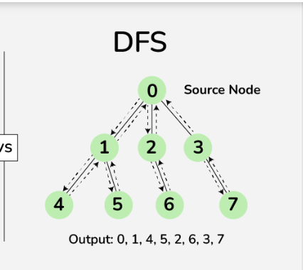

# Algorithm Facts
Tree searching algorithm that works on acyclical graphs. The function traverses to the end of the graph and then backtracks, marking nodes as finished. Preorder, inorder, and postorder all refer to the order nodes are explored.

Purposes include 
- finding connected components
- Topological sorting
- determining whether a graph is a DAG 

## Time Complexity
O(n+m) - traverses all nodes and edges 

## Space Complexity
O(nm) - the input is a tree with n nodes and m edges

